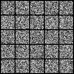

# NCSN-MNIST: Noise Conditional Score Networks for MNIST

This project implements a Noise Conditional Score Network (NCSN) for the MNIST dataset using PyTorch. The implementation is based on the paper "Generative Modeling by Estimating Gradients of the Data Distribution" by Song and Ermon.



## Features

- Implementation of Noise Conditional Score Networks (NCSN)
- Training and testing on MNIST dataset
- Configurable model architecture and training parameters
- Support for GPU training
- Comprehensive logging and visualization
- Model checkpointing and training resumption

## Requirements

- Python 3.x
- PyTorch
- NumPy
- PyYAML
- Matplotlib (for visualization)

## Installation

1. Clone the repository
2. Install the required packages:
```bash
pip install torch numpy pyyaml matplotlib
```

## Usage

### Training

To train the model:
```bash
python main.py --config config.yml
```

Additional training options:
- `--seed`: Set random seed (default: 1234)
- `--run`: Specify output directory (default: 'run')
- `--doc`: Documentation string (default: '0')
- `--comment`: Additional experiment comment
- `--verbose`: Logging level (info | debug | warning | critical)
- `--resume_training`: Resume from a previous checkpoint

## Configuration

The `config.yml` file contains all the training and model parameters:

- Training parameters:
  - batch_size: 128
  - n_epochs: 10
  - n_iters: 200000
  - snapshot_freq: 1000

- Model parameters:
  - sigma_begin: 1.0
  - sigma_end: 0.01
  - num_classes: 10
  - ngf: 64

- Optimizer parameters:
  - optimizer: "Adam"
  - lr: 0.001
  - beta1: 0.9

## Project Structure

```
ncsn-mnist/
├── config.yml         # Configuration file for model and training parameters
├── main.py           # Main entry point for training and testing
├── model.py          # NCSN model architecture implementation
├── runner.py         # Training and testing runner implementation
├── report.ipynb      # Jupyter notebook for analysis and visualization
├── images/           # Directory for generated images
└── run/              # Directory for training logs and checkpoints
```

## Model Architecture

The model implements a conditional score network with:
- Conditional instance normalization
- Residual blocks
- Refinement blocks
- Multi-scale feature processing

## Results

The model generates MNIST digits by learning the score function of the data distribution. Generated samples can be found in the `images/` directory.

## Acknowledgments

- Based on the paper "Generative Modeling by Estimating Gradients of the Data Distribution" by Song and Ermon